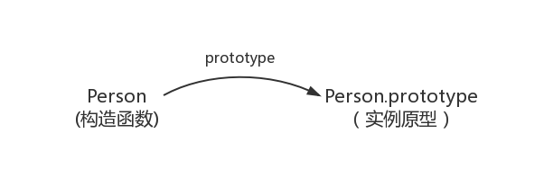
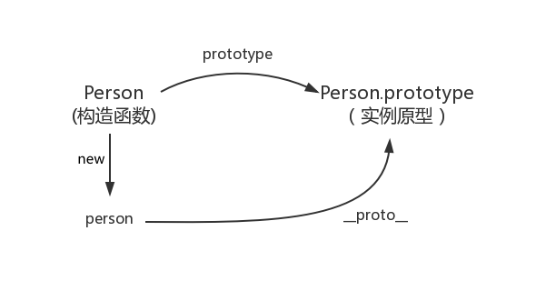
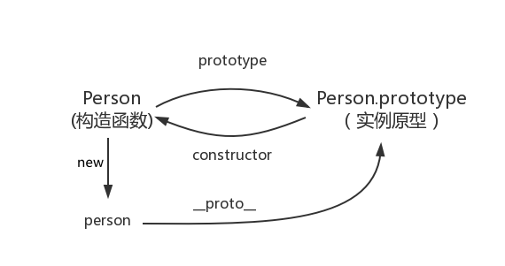
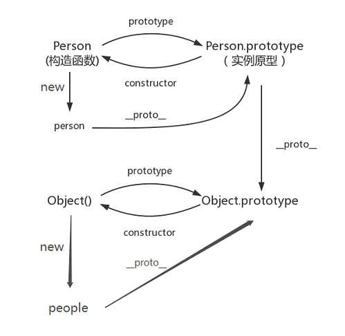
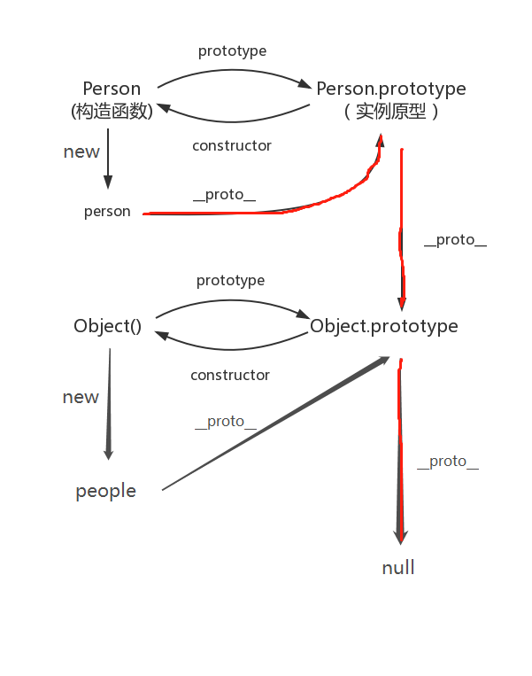
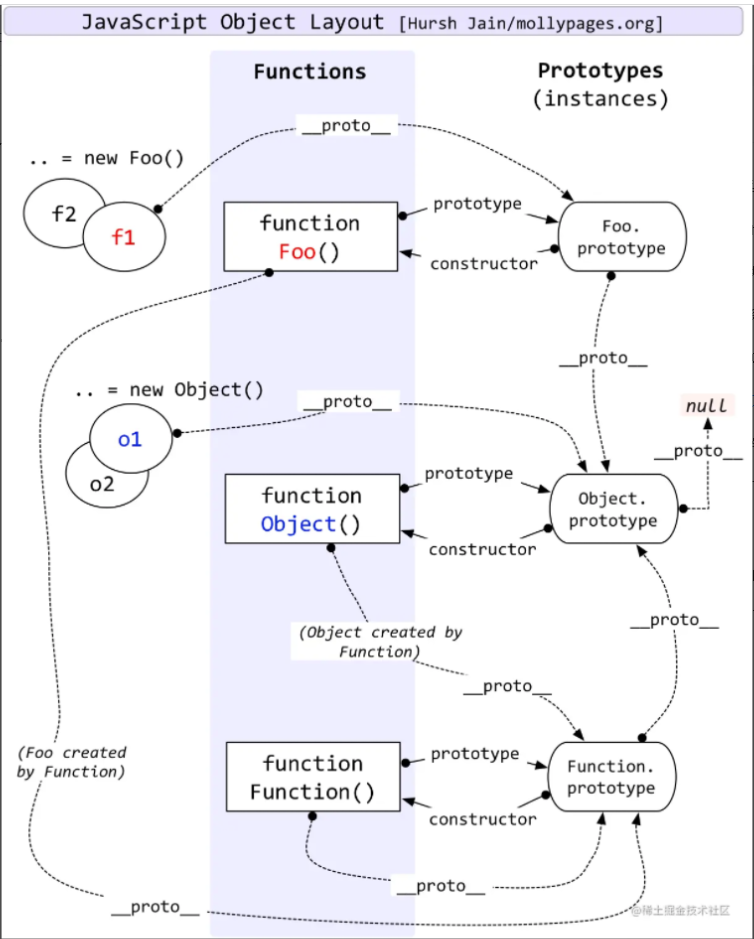

# 原型链


### 构造函数创建对象


先用构造函数创建一个对象。

```javascript
function Person() {}
let man = new Person()

man.name = '张三'
console.log(man.name) // 张三 
```

Person就是一个构造函数，man就是构造函数Person的实例对象。

------

**Prototype**

每一个函数都有一个prototype属性，并且只是函数才会有的属性。

```js
function Person() {}
Person.prototype.name = '张三'

let manOne = new Person()
let manTwo = new Person()

console.log(manOne.name)	// 张三 
console.log(manTwo.name)	// 张三 
```

为什么实例后的对象可以通过 **.** 语法拿到Person.prototype的name属性呢？prototype到底指向的是什么？

其实，函数的prototype属性指向了一个对象，这个对象正是该构造函数所创建出的实例的原型，也就是上述例子中manOne和manTwo的原型。

什么是原型？每一个JavaScript对象（null除外）在创建的时候就会关联另一个对象，这个对象就是我们所说的原型，每一个对象都会从原型‘’继承‘’属性。

所以知道了原型理解上述例子就很好理解了，Person.prototype指向了原型对象，并且给原型对象上添加了一个name属性。而这个原型对象，就是 new Person 后的实例对象的原型对象，就是manOne和manTwo的原型对象，而实例对象可以继承原型对象的属性，所以manOne和manTwo才能使用 **.** 语法拿到name属性的值

此图表示构造函数和实例之间的关系：



在此图中，我们用Object.prototype表示实例原型

那么实例对象和实例原型对象该如何表示？也就是man和Person.protorype之间改如何表示？这就要提到第二个属性——proto—— （下划线）

------

**——proto——**

这个属性是每一个JavaScript对象（null除外）都具有的一个属性。这个属性会指向该对象的原型

```js
function Person() {

}

let person = new Person()
console.log(Person.prototype === person.__protp__) // true
```

于是就有了下图：



既然实例对象和构造函数都可以指向原型，那么原型是否有属性指向构造函数或者实例呢？

------

**constructor**

原型不能指向实例，因为一个构造函数可以有多个实例对象，但是原型可以指向构造函数。这就要提到constructor属性了，每一个原型都有一个constructor属性指向关联的构造函数

```
function Person() {

}

console.log(Person.prototype.constructor === Person) // true
```

如此关系图再次更新：



综上，我们得出：

```js
function Person() {

}
let person = new Person()

console.log(Person.prototype === person.__proto__)	// true
console.log(Person.prototype.constructor === Person)	// true
// 顺便学习一个ES5的方法,可以获得对象的原型
console.log(Object.getPrototypeOf(person) === Person.prototype)	// true
```

------

**实例与原型**

当读取实例的属性时，如果找不到，就会查找与对象关联的原型中的属性，如果还查不到，就去找原型的原型，一直找到最顶层为止。

例如：

```js
function Person() {

}
let man = new Person()
man.age = 20
console.log(man.age) // 20 
console.log(man.name) // undefined

Person.prototype.name = '张三'

console.log(man.age) // 20 
console.log(man.name) // 张三
```

在这个例子中，我们给man这个实例添加了age属性，但是没有添加name属性。在前两次打印的时候，因为man有age属性所以打印出来age为20，但是没有name属性所以为undefined。在后两次的打印的时候，因为我们在打印前在原型上添加的name属性。所以打印出来name值为原型上添加的name属性的值。

------

**原型的原型**

前面我们说了，原型也是一个对象。那么既然是对象也是有——proto——属性的。那么这个属性指的就是原型的原型

```js
function Person() {

}

let person = new Person()
let people = new Object()
person.__proto__.__proto__.name = '王五'

console.log(people.name) // 王五
console.log(people.__proto__ === person.__proto__.__proto__)  // true
```

从上述例子中看到，我在person实例的原型的原型上添加了一个属性name。然后我有用js内置对象Object创建一个实例，竟然发现Object的实例对象people可以拿到person实例的原型的原型上的name。然后我们就发现，Object实例的原型和person实例的原型的原型是一样的。这样我们就得出一个结论，构造函数的原型的原型指向的都是系统构造函数Object.prototype。

从而关系图再次更新：




------

**原型链**

那么 Object.prototype 的原型是什么呢？ 是null

```
console.log(Object.prototype.__proto__) // null
console.log(Object.prototype.__proto__ === null) // true
```

所以 Object.prototype.——proto—— 的值为 null 跟 Object.prototype 没有原型，其实表达了一个意思。

所以查找属性的时候查到 Object.prototype 就可以停止查找了。

最后一张关系图也可以更新为：



图中由相互关联的原型组成的链状结构就是原型链，就是红色标出的这些线路


一张完整的原型和原型链图。



**补充**

构造函数也是对象，所以构造函数也有——proto——属性

构造函数的——proto——属性指向的是Function构造函数的原型上

而Function.prototype的——proto——属性指向的是Object.prototype。系统构造函数Object的实例原型上

```js
function Person() {}

console.log(Person.__proto__ === Object.__proto__ === Function.prototype) // type
```

